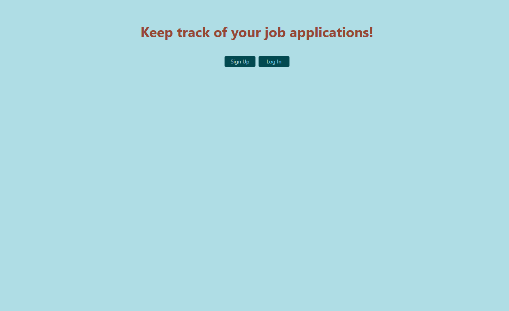
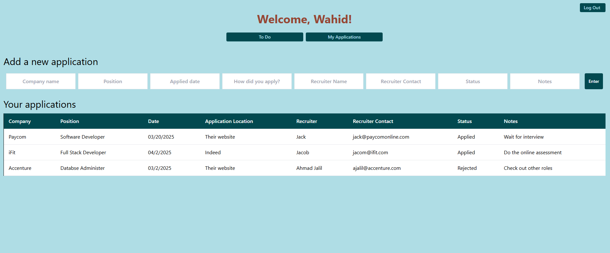

# 🎯 Job Tracker

A full-stack web app to help you manage your job applications — track companies, positions, recruiters, interview status, and notes all in one place.

🌐 **Live Demo:** [job-tracker-xkmo.onrender.com](https://job-tracker-xkmo.onrender.com)

---

## 🚀 Tech Stack

**Frontend**
- React (Create React App + Hooks + React Router)
- Axios for API calls
- TailwindCSS for styling

**Backend**
- FastAPI (Python)
- SQLAlchemy ORM
- Alembic for migrations
- JWT auth (OAuth2PasswordBearer)
- Passlib for password hashing
- PostgreSQL (Render-hosted)

**Deployment**
- Render (Backend API + Static Frontend + Postgres DB)

---

## ✨ Features

- 🔐 User authentication (signup, login with JWT)
- 📝 Add, update, and view job applications
- 👤 User-specific data (apps tied to logged-in user)
- 🌍 Live deployment on Render
- 💾 Persistent data storage with PostgreSQL
- 🛡️ Secure password hashing & JWT token-based auth

---

## 📸 Screenshots


### Signup


### Applications

---

## ⚙️ Getting Started (Local Dev)

### 1. Clone the repo
```bash
git clone https://github.com/<your-username>/<your-repo>.git
cd jobtracker
